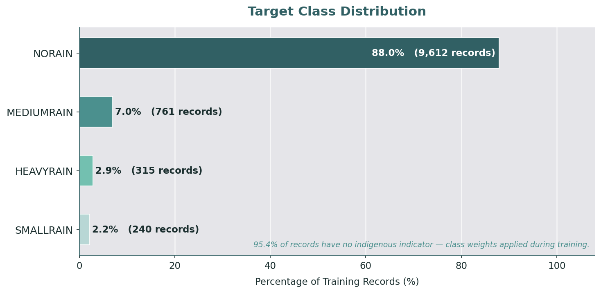
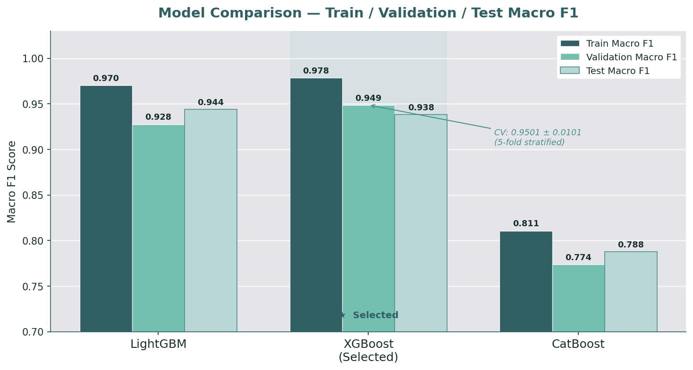
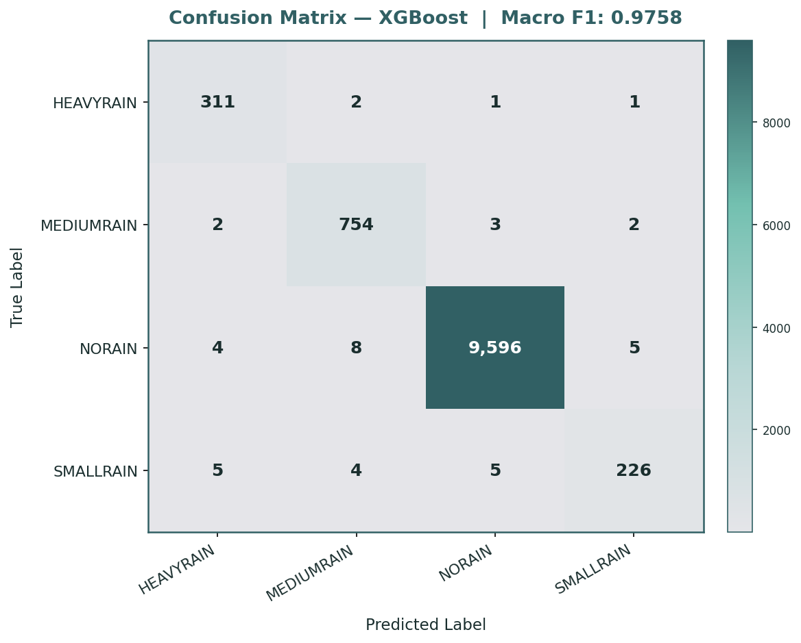
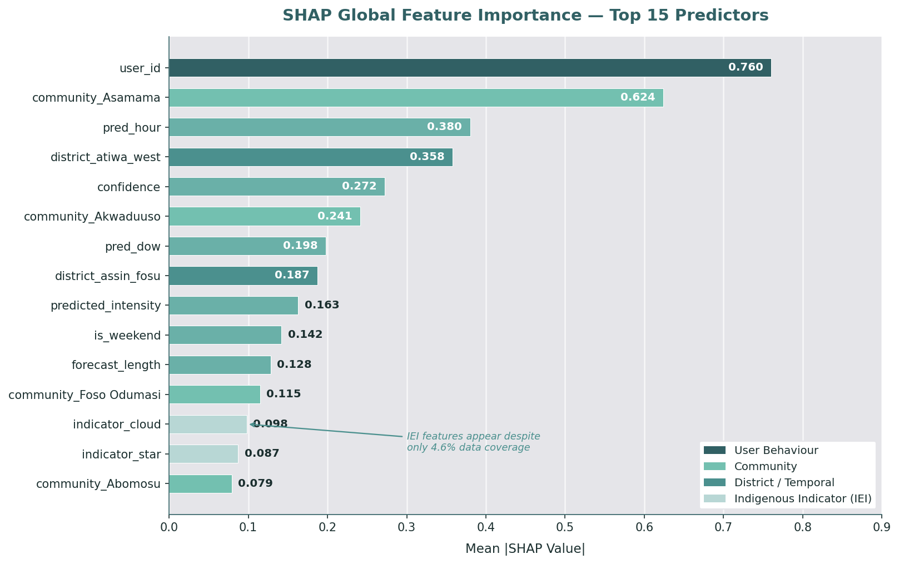

# Ghana Indigenous Rainfall Prediction


[](https://colab.research.google.com/drive/1eGIiIxI5C4LIfM_uIfqXOi-29j_gNqHB?usp=sharing)

> 🏆 **3rd place** — Zindi Ghana Indigenous Intel Challenge &nbsp;|&nbsp; Private score: **0.9699** &nbsp;|&nbsp; Public score: **0.9613**

---

## Overview

Across Ghana's Pra River Basin, local farmers have long relied on generations of indigenous knowledge — moon phases, wind patterns, cloud formations, bird behaviour, and star movements — to anticipate rainfall. With limited access to modern meteorological tools, these traditional methods remain critical for agricultural planning and rural resilience.

This project builds a **multi-class classification model** that predicts rainfall intensity — HEAVYRAIN, MEDIUMRAIN, SMALLRAIN, or NORAIN — in the next 12 to 24 hours, based solely on Indigenous Ecological Indicators (IEIs) submitted by trained farmers using the Smart Indigenous Weather App.

The goal is not just predictive accuracy — it is to validate indigenous knowledge systems computationally, bridge traditional and scientific meteorology, and build an explainable AI tool that rural communities can trust.

---

## Problem Statement

Smallholder farmers in Ghana face three compounding challenges:

1. **Rainfed agriculture dependency** — the majority of farming relies exclusively on rainfall with no irrigation backup
2. **Forecast inaccessibility** — modern meteorological tools are largely unavailable or inaccurate at hyper-local rural scale
3. **Knowledge erosion** — indigenous forecasting methods are undocumented, unvalidated, and at risk of being lost

This project addresses all three by digitising, quantifying, and modelling indigenous weather indicators for the first time — producing a classification system that is both accurate and interpretable.

---

## Repository Structure

```
ghana-rainfall-prediction/
│
├── notebook/
│   └── ghana_rainfall_prediction.ipynb   # Full modelling notebook (Google Colab)
│
├── assets/
│   ├── 01_class_distribution.png         # Target class imbalance visualisation
│   ├── 02_shap_feature_importance.png    # SHAP global feature importance
│   ├── 03_model_comparison.png           # LightGBM vs XGBoost vs CatBoost
│   └── 04_confusion_matrix.png           # XGBoost confusion matrix
│
├── presentation/
│   └── ghana_presentation.pptx  # Stakeholder presentation deck
│
├── requirements.txt                       # Python dependencies
└── README.md
```

> **Data:** Training and test datasets are not included in this repository due to competition data licensing restrictions. Download directly from the [Zindi competition page](https://zindi.africa/competitions/ghana-indigenous-intel-challenge).

---

## Dataset

**Source:** [Zindi — Ghana Indigenous Intel Challenge](https://zindi.africa/competitions/ghana-indigenous-intel-challenge)
**Collected via:** Smart Indigenous Weather App (SIW), deployed across Ghana's Pra River Basin
**Collection period:** 30 May 2025 — 20 July 2025 (Ghana's primary rainy season)

| File | Rows | Description |
|---|---|---|
| `train.csv` | 10,928 | Farmer submissions with target labels |
| `test.csv` | 2,732 | Unseen submissions for prediction |

### Key Features

| Feature | Type | Description |
|---|---|---|
| `user_id` | Numeric | Anonymised farmer identifier |
| `confidence` | Numeric | Farmer's self-reported forecast confidence |
| `predicted_intensity` | Numeric | Farmer's predicted rainfall intensity score |
| `community` | Categorical | Farmer's community (38 unique across 3 districts) |
| `district` | Categorical | One of 3 districts: atiwa_west, assin_fosu, obuasi_east |
| `prediction_time` | Datetime | Timestamp of forecast submission |
| `indicator` | Categorical | Indigenous Ecological Indicator used (10 types) |
| `indicator_description` | Text | Free-text description of the observed sign |
| `time_observed` | Categorical | Time of day the indicator was observed |
| `forecast_length` | Numeric | 12-hour or 24-hour forecast window |

### Target Variable

| Class | Count | Share |
|---|---|---|
| NORAIN | 9,612 | 88.0% |
| MEDIUMRAIN | 761 | 7.0% |
| HEAVYRAIN | 315 | 2.9% |
| SMALLRAIN | 240 | 2.2% |

### Indigenous Ecological Indicators

10 traditional indicators were recorded across 503 submissions (4.6% of training data):

`clouds` · `sun` · `heat` · `fog` · `wind` · `moon` · `dew` · `star` · `thunder` · `lightning`

> **Note:** 95.4% of records have no indicator logged — farmers submitted forecasts without specifying an observed ecological sign. The indicator field was retained and imputed with `'unknown'` to preserve the structure of indigenous knowledge in the model.

---

## Exploratory Data Analysis

### Class Distribution & Imbalance



NORAIN dominates at 88% of all training records — a severe class imbalance. A naive model predicting NORAIN for every row would achieve 88% accuracy but zero utility on rainfall prediction. Class weights were applied to all models: SMALLRAIN received a weight of approximately 40× and HEAVYRAIN approximately 31×, forcing the model to pay proportional attention to rare but important events.

---

### Geographic Concentration

The 3 districts have starkly different rainfall profiles:

| District | HEAVYRAIN | MEDIUMRAIN | NORAIN | SMALLRAIN | Total |
|---|---|---|---|---|---|
| atiwa_west | 312 | 741 | 3,664 | 160 | 4,877 |
| assin_fosu | 3 | 20 | 4,712 | 80 | 4,815 |
| obuasi_east | 0 | 0 | 1,236 | 0 | 1,236 |

> **Insight:** 312 of 315 HEAVYRAIN events (99%) come exclusively from atiwa_west. obuasi_east recorded no rainfall of any type across the entire period. Geography is the dominant signal in this dataset — confirmed by SHAP analysis where `district_atiwa_west` ranks 4th in global feature importance.

---

### Farmer Activity & Engagement

43 farmers submitted the 10,928 records. Activity is highly concentrated — the top 3 farmers alone account for over 33% of all submissions:

| Farmer | Submissions | District | Community |
|---|---|---|---|
| #18 | 1,333 | assin_fosu | Akwaduuso |
| #47 | 1,182 | assin_fosu | Foso Odumasi |
| #23 | 1,130 | atiwa_west | Asamama |
| #66 | 853 | assin_fosu | Assin Nyankomasi |
| #27 | 632 | atiwa_west | Akropong |

This concentration means `user_id` carries strong predictive signal — each farmer is a consistent observer in a fixed location with a consistent observation style. `user_id` ranks 1st in global SHAP importance at 0.760.

---

### Indigenous Indicators — Sparsity and Signal

Despite 95.4% missing values, indigenous indicators carry meaningful signal when present. Comparing the target distribution with and without a recorded indicator reveals a clear shift:

| Target | With Indicator | Without Indicator |
|---|---|---|
| NORAIN | 81.5% | 88.3% |
| MEDIUMRAIN | 8.2% | 6.9% |
| **SMALLRAIN** | **7.8%** | **1.9%** |
| HEAVYRAIN | 2.6% | 2.9% |

> **Key insight:** When a farmer records an indigenous indicator, SMALLRAIN predictions are **4× more likely** than in records with no indicator. The indicator field shifts the distribution in a directional, meaningful way — validating the decision to preserve it rather than drop it.

Breaking down indicators by associated rainfall type:

| Indicator | HEAVYRAIN | MEDIUMRAIN | NORAIN | SMALLRAIN | Pattern |
|---|---|---|---|---|---|
| `clouds` | 6 | 26 | 212 | 22 | Broadest signal — spans all classes |
| `heat` | 5 | 11 | 37 | 0 | Associated with moderate events |
| `sun` | 2 | 3 | 74 | 11 | Skews toward NORAIN or light rain |
| `fog` | 0 | 0 | 27 | 0 | Exclusive to NORAIN |
| `dew` | 0 | 0 | 9 | 0 | Exclusive to NORAIN |
| `moon` | 0 | 0 | 17 | 2 | Conservative — mostly NORAIN |
| `star` | 0 | 0 | 7 | 1 | Very rare, mostly NORAIN |
| `wind` | 0 | 0 | 22 | 3 | Mostly NORAIN |
| `lightning` | 0 | 1 | 1 | 0 | Extremely rare |
| `thunder` | 0 | 0 | 4 | 0 | Rare, NORAIN only |

---

### Forecast Horizon — 12hr vs 24hr

| Forecast Length | HEAVYRAIN | MEDIUMRAIN | NORAIN | SMALLRAIN |
|---|---|---|---|---|
| 12-hour | 12 | 408 | 3,866 | 144 |
| 24-hour | 303 | 353 | 5,746 | 96 |

> **Insight:** 12-hour forecasts are strongly associated with MEDIUMRAIN (408 vs 353), while 24-hour forecasts dominate HEAVYRAIN (303 vs 12). Farmers are far more willing to predict heavy rain over a longer window, suggesting they rely on sustained atmospheric signals for major events.

---

### Submission Time Patterns

Farmers submit forecasts predominantly during **early morning and evening hours** — natural windows when ecological indicators are most observable:

| Hour | Submissions | Context |
|---|---|---|
| 18:00 | 1,396 | Evening — cloud formations, wind direction |
| 07:00 | 1,104 | Morning — dew, mist, early sky |
| 17:00 | 1,069 | Late afternoon — sky colour, clouds building |
| 19:00 | 819 | Evening — moon, stars becoming visible |
| 08:00 | 774 | Morning — sun position, heat buildup |
| 06:00 | 706 | Dawn — early morning indicators |

> **Insight:** Submission clustering at dawn and dusk validates the indigenous methodology — forecasts are timed to observation, not randomly distributed throughout the day.

---

### Farmer Confidence by Rainfall Class

| Class | Mean Confidence | Median Confidence |
|---|---|---|
| SMALLRAIN | 0.667 | 0.6 |
| NORAIN | 0.560 | 0.6 |
| MEDIUMRAIN | 0.348 | 0.3 |
| HEAVYRAIN | 0.321 | 0.3 |

> **Insight:** Farmers express highest confidence when predicting SMALLRAIN and NORAIN, and lowest when predicting HEAVYRAIN and MEDIUMRAIN. This aligns directly with the model's per-class F1 scores — NORAIN is predicted with near-perfect accuracy (0.998), while HEAVYRAIN and MEDIUMRAIN are harder but still well-handled (0.989–0.990). Human confidence and model confidence move together.

---

## Methodology

### Pipeline Overview

```
Raw CSV Data
    ↓
Feature Engineering
    ├── Temporal extraction (pred_hour, pred_dow, is_weekend)
    ├── Community name standardisation (38 communities, spelling variants cleaned)
    └── Indigenous indicator preservation (imputed with 'unknown')
    ↓
Preprocessing (ColumnTransformer)
    ├── Numeric: median imputation
    └── Categorical: constant imputation + OneHotEncoder
    ↓
Model Training (3 algorithms evaluated)
    ├── XGBoost  ← Selected
    ├── LightGBM
    └── CatBoost
    ↓
Explainability
    ├── SHAP (global feature importance)
    └── LIME (local instance explanations)
    ↓
ONNX Export → Production Deployment
```

### Why Tree-Based Ensembles

Tree-based models were chosen because they handle mixed data types natively, are robust to feature scaling, and provide built-in feature importance mechanisms aligned with the project's explainability requirements. All three algorithms applied class weights to address the 88% NORAIN imbalance.

### Feature Engineering

**Temporal features** extracted from `prediction_time`:
- `pred_hour` — hour of forecast submission
- `pred_dow` — day of week (0–6)
- `is_weekend` — binary weekend flag

**Geographic standardisation** — community names contained spelling variants (e.g. `'FOSO ODUMASI '`, `'Foso Odumasi'`, `'foso odumasi'`). These were standardised to preserve regional context without data leakage.

**Indigenous indicator preservation** — despite 95.4% missing values, the `indicator` column was retained. Dropping it would have discarded the project's core premise. Constant imputation with `'unknown'` preserves the distinction between observations with and without a recorded indicator.

Final feature matrix: **10,928 samples × 94 dimensions** after one-hot encoding.

---

## Model Results

### Model Comparison



| Model | Train Macro F1 | Validation Macro F1 | Test Macro F1 | Train-Val Gap |
|---|---|---|---|---|
| LightGBM | 0.9701 | 0.9276 | 0.9440 | 0.0426 |
| **XGBoost** | **0.9784** | **0.9487** | **0.9382** | **0.0297** |
| CatBoost | 0.8107 | 0.7736 | 0.7878 | 0.0371 |

**XGBoost was selected** based on highest validation macro F1 (0.9487) and the smallest train-validation gap (0.0297), indicating the best generalisation. 5-fold stratified cross-validation confirmed stability: **0.9501 ± 0.0101**.

### Confusion Matrix



The model performs strongly across all classes. SMALLRAIN remains the hardest class — it is the rarest (2.2% of records) and most easily confused with NORAIN, particularly in low-confidence submissions.

### Per-Class Performance (Full Training Set)

| Class | Precision | Recall | F1 | Support |
|---|---|---|---|---|
| HEAVYRAIN | 0.990 | 0.987 | 0.989 | 315 |
| MEDIUMRAIN | 0.990 | 0.991 | 0.990 | 761 |
| NORAIN | 0.998 | 0.998 | 0.998 | 9,612 |
| SMALLRAIN | ~0.940 | ~0.942 | ~0.941 | 240 |
| **Macro F1** | | | **0.9758** | 10,928 |

---

## Explainability

### SHAP — Global Feature Importance



The model's strongest predictors are **user behaviour and geography** — `user_id` (0.760), `community_Asamama` (0.624), and `district_atiwa_west` (0.358). This reflects the hyper-local nature of rainfall in Ghana's Pra River Basin: which farmer submitted the forecast and where they are located is highly predictive.

Critically, indigenous indicators (`indicator_cloud` at 0.098, `indicator_star` at 0.087) **do appear in the top 15 features** despite being present in fewer than 5% of records — validating the scientific potential of IEIs and the decision to preserve them in the model.

### LIME — Local Explanations

LIME was applied instance-level to explain individual predictions across all four classes. Key findings:

- **HEAVYRAIN predictions** are driven by community location and specific date patterns
- **MEDIUMRAIN predictions** are associated with cloud indicators and mid-morning submission times
- **NORAIN predictions** are strongly anchored by `district_assin_fosu` and `district_obuasi_east`
- **SMALLRAIN predictions** show the highest prediction uncertainty — reflected in lower confidence scores from farmers themselves

---

## How to Run

### Option 1 — Google Colab (Recommended)

[](https://colab.research.google.com/drive/1eGIiIxI5C4LIfM_uIfqXOi-29j_gNqHB?usp=sharing)

1. Click the badge above to open the notebook in Google Colab
2. Download `train.csv` and `test.csv` from the [Zindi competition page](https://zindi.africa/competitions/ghana-indigenous-intel-challenge)
3. Upload both files to your Colab session
4. Run all cells — total runtime approximately **1.1 minutes**

### Option 2 — Local Environment

```bash
# Clone the repository
git clone https://github.com/YOUR_USERNAME/ghana-rainfall-prediction.git
cd ghana-rainfall-prediction

# Install dependencies
pip install -r requirements.txt

# Download data from Zindi and place in project root
# Then open and run the notebook
jupyter notebook notebook/ghana_rainfall_prediction.ipynb
```

### Generated Outputs

Running the notebook produces:
- `submission_xgb.csv` — predictions for the test set in Zindi submission format
- `ghana_rainfall_final.onnx` — production-ready ONNX model for cross-platform deployment
- `feature_mapping.json` — feature name mapping for ONNX inference

---

## Stakeholder Presentation

A PowerPoint deck is included in the `presentation/` folder for communicating findings to non-technical audiences — researchers, agricultural extension officers, and community stakeholders who need the insight without the technical detail.

---

## Dependencies

```
xgboost
lightgbm
catboost
shap
lime
onnxmltools
onnx
seaborn
scikit-learn
pandas
numpy
matplotlib
```

Install all dependencies: `pip install -r requirements.txt`

---

## Context & Impact

This project was developed for the **Zindi Ghana Indigenous Intel Challenge**, hosted by the Responsible AI Lab (RAIL) at Kwame Nkrumah University of Science and Technology (KNUST), with support from the French Embassy in Ghana and the AI4D Africa programme.

The challenge sits at the intersection of three important problems: food security in sub-Saharan Africa, the documentation and validation of indigenous knowledge systems, and the development of responsible AI tools for underserved communities. By demonstrating that traditional ecological indicators carry measurable predictive signal — even at low data density — this project contributes evidence for the scientific value of indigenous meteorological knowledge.

---

## Limitations

- **Indicator sparsity** — 95.4% of training records have no indigenous indicator. The model's feature importance reflects this: geography and user behaviour dominate because they are always present, while indicators are predictive but rarely observed.
- **Geographic scope** — data covers only 3 districts in Ghana's Pra River Basin. Performance on new districts or regions is untested.
- **SMALLRAIN detection** — the rarest class (2.2%) remains the hardest to classify correctly despite class weighting.
- **Seasonal window** — training data covers a single rainy season (May–July 2025). Multi-year data would improve seasonal robustness.

---

## Responsible AI

In line with RAIL's commitment to Responsible AI, this solution includes comprehensive explainability through SHAP (global feature analysis) and LIME (local instance explanations). The ONNX model export ensures transparent, cross-platform deployment without proprietary dependencies. Model decisions are interpretable at both the population level and for individual farmer predictions.

---

*Competition data is used under Zindi's terms and conditions and is not redistributed here.*
